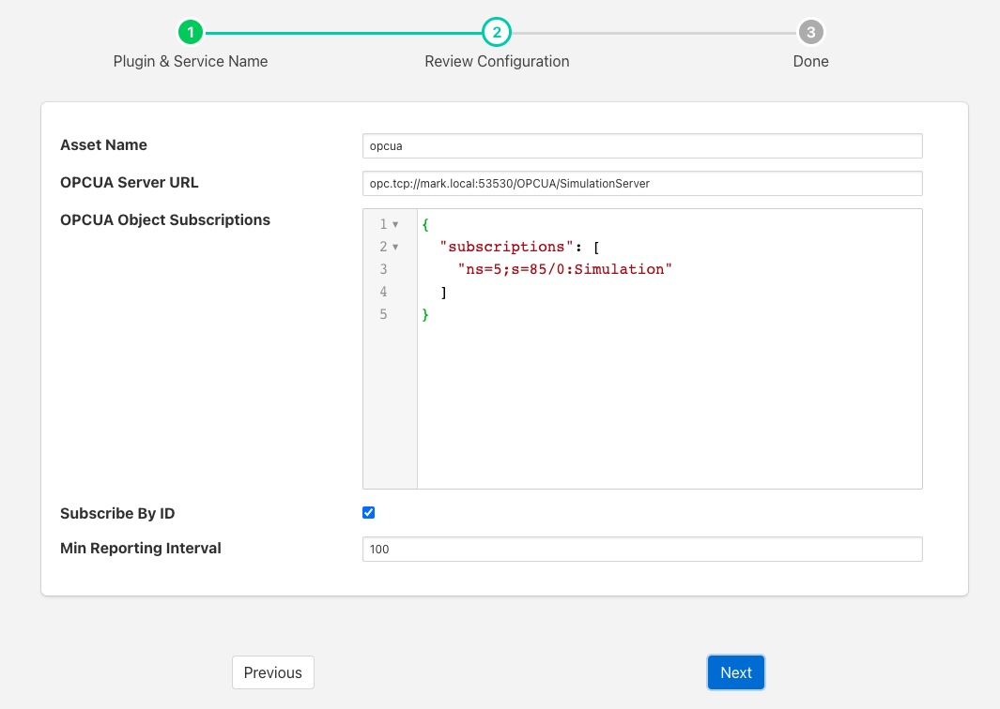

.. Images

.. |UaExpert| raw:: html

    <a href="https://www.unified-automation.com/downloads/opc-ua-clients.html">Ua Expert</a>

OPC/UA South Plugin
===================

The *fledge-south-opcua* plugin allows Fledge to connect to an OPC/UA server and subscribe to changes in the objects within the OPC/UA server.

A south service to collect OPC/UA data is created in the same way as any other south service in Fledge.

  - Use the *South* option in the left hand menu bar to display a list of your South services

  - Click on the + add icon at the top right of the page

  - Select the *opcua* plugin from the list of plugins you are provided with

  - Enter a name for your south service

  - Click on *Next* to configure the OPC/UA plugin

+-----------+
| |opcua_1| |
+-----------+

The configuration parameters that can be set on this page are;

  - **Asset Name**: This is a prefix that will be applied to all assets that are created by this plugin. The OPC/UA plugin creates a separate asset for each data item read from the OPC/UA server. This is done since the OPC/UA server will deliver changes to individual data items only. Combining these into a complex asset would result in assets that contain only one of many data points in each update. This can cause problems in upstream systems with the ever-changing asset structure.

  - **OPCUA Server URL**: This is the URL of the OPC/UA server from which data will be extracted. The URL should be of the form opc.tcp://..../

  - **OPCUA Object Subscriptions**: The subscriptions are a set of locations in the OPC/UA object hierarchy that defined which data is subscribed to in the server and hence what assets get created within Fledge. A fuller description of how to configure subscriptions is shown below.

  - **Subscribe By ID**: This toggle determines if the OPC/UA objects in the subscription are using names to identify the objects in the OPC/UA object hierarchy or using object ID's.

  - **Asset Name Source**: This drop-down allows you to choose the source of the name for the Asset in Fledge. The choices are:

      - *NodeId*: the Node Id of the OPC UA node. This is the default.
      - *BrowseName*: the Browse Name of the OPC UA node.
      - *Subscription Path with NodeId*: the path to the node in the OPC/UA server's object hierarchy starting with the node specified in *Subscriptions.*
        Every node in the hierarchy is named with its Node Id.
        The Node Id is also used as the Data Point name.
      - *Subscription Path with BrowseName*: same as *Subscription Path with NodeId* except that the Browse Name is used as the name of every node in the hierarchy.
        The Browse Name is also used as the Data Point name.
      - *Full Path with NodeId*: the path to the node in the OPC/UA server's object hierarchy starting with the top-level *Objects* folder.
        Every node in the hierarchy is named with its Node Id.
        The *Objects* folder itself is not part of the full path.
        The Node Id is also used as the Data Point name.
      - *Full Path with BrowseName*: same as *Full Path with NodeId* except that the Browse Name is used as the name of every node in the hierarchy.
        The Browse Name is also used as the Data Point name.

  - **Asset Path Delimiter**: A character to separate segments of the Asset Path.
    The delimiter is a single character.
    If multiple characters are specified, the string will be truncated to one character.
    The default is the forward slash ("/").

  - **Min Reporting Interval**: This controls the minimum interval between reports of data changes in subscriptions. It sets an upper limit to the rate that data will be ingested into the plugin and is expressed in milliseconds.

Subscriptions
-------------

Subscriptions to OPC/UA objects are stored as a JSON object that contains an array named "subscriptions". This array is a set of OPC/UA nodes that will control the subscription to variables in the OPC/UA server.

The array may be empty, in which case all variables are subscribed to in the server and will create assets in Fledge. Note that simply subscribing to everything will return a lot of data that may not be of use.

If the *Subscribe By ID*  option is set then this is an array of Node Id's. Each Node Id should be of the form *ns=..;s=...* Where *ns* is a namespace index and *s* is the Node Id string identifier. A subscription will be created with the OPC/UA server for the object with the specified Node Id and its children, resulting in data change messages from the server for those objects. Each data change received from the server will create an asset in Fledge with the name of the object prepended by the value set for *Asset Name*. An integer identifier is also supported by using a Node Id of the form *ns=...;i=...*.

If the *Subscribe By ID* option is not set then the array is an array of Browse Names. The format of the Browse Names is <namespace>:<name>. If the namespace is not required then the name can simply be given, in which case any name that matches in any namespace will have a subscription created. The plugin will traverse the node tree of the server from the *ObjectNodes* root and subscribe to all variables that live below the named nodes in the subscriptions array.

Configuration examples
~~~~~~~~~~~~~~~~~~~~~~

.. code-block:: console

    {"subscriptions":["5:Simulation","2:MyLevel"]}

We subscribe to

 - 5:Simulation is a node name under ObjectsNode in namespace 5

 - 2:MyLevel is a variable under ObjectsNode in namespace 2

.. code-block:: console

    {"subscriptions":["5:Sinusoid1","2:MyLevel","5:Sawtooth1"]}

We subscribe to

 - 5:Sinusoid1 and 5:Sawtooth1 are variables under ObjectsNode/Simulation in namespace 5

 - 2:MyLevel is a variable under ObjectsNode in namespace 2

.. code-block:: console

    {"subscriptions":["2:Random.Double","2:Random.Boolean"]}

We subscribe to

 - Random.Double and Random.Boolean are variables under ObjectsNode/Demo both in namespace 2

It's also possible to specify an empty subscription array:

.. code-block:: console

    {"subscriptions":[]}

.. note:: 
  Depending on OPC/UA server configuration (number of objects, number of variables) this empty configuration might take a long time to create the subscriptions and hence delay the startup of the south service. It will also result in a large number of assets being created within Fledge.

Object names, variable names and NamespaceIndexes can be easily retrieved browsing the given OPC/UA server using OPC UA clients, such as |UaExpert|.
